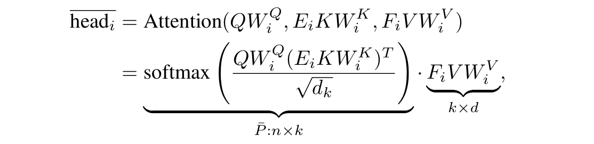

## Linrec

注意到softmax（**e**）对e的每一行的和是1，而且每一行的每个元素都是大于0的，应用这两个属性把O（n$^2$d)的时间复杂度变成O（nd$^2$）

A = softmax(QK/$d^{1/2}$)V   用两个函数P1 P2来替换softmax    但是要保证 P1（Q）@P2（K）要满足上面的两个性质

然后可以用L2Norm对Q和K作为P1 P2

A = P1(Q) * P2(K) * V 时间复杂度变成O（nd$^2$） n >> d 所以就是O（n）

## Linformer

注意到self-attention is low rank，所以可以将softmax进行SVD分解，将前K个特征向量作为Q、K两个矩阵，时间复杂度变小

但是注意到SVD需要额外的时间，所以采用另一种方法将Q K通过两个矩阵E、F映射到K维 然后E、F是可学习的

