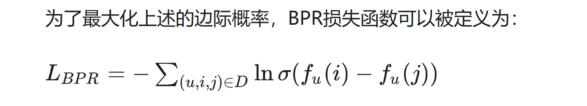

## BPR Loss
BPR（Bayesian Personalized Ranking）损失函数是一种用于学习推荐系统中用户个性化偏好的损失函数。它最初是由 Steffen Rendle 等人在论文 BPR: Bayesian Personalized Ranking from Implicit Feedback 中提出的。
在推荐系统中，用户的历史行为数据通常是以隐式反馈形式存在的，例如用户的浏览、购买或点击行为。与显式反馈数据（例如用户的评分）相比，隐式反馈数据更加稀疏和难以解释。因此，推荐系统需要开发出适合隐式反馈数据的模型和算法来推荐物品。
BPR损失函数就是为解决隐式反馈数据下的推荐问题而提出的。它的基本思想是：**给定一个用户和两个物品，模型需要将用户更喜欢的物品排在用户更不喜欢的物品之前，从而学习到用户的个性化偏好。** 


+ 均方误差
+ 平均绝对误差
+ 交叉熵损失
+ 对数损失
+ 多类别交叉熵损失
+ 二分类交叉熵损失
+ 余弦相似度损失
+ 希尔伯特-施密特口袋
+ Huber损失
+ 感知器损失

1、均方误差
均方误差是通过计算预测值与真实值之间差异的平方和来衡量模型的性能。它对于较大的差异给予更高的权重，因为平方操作会放大较大的差异。均方误差的数值越小，表示模型预测的结果与真实值越接近。

```python
import numpy as np
import matplotlib.pyplot as plt

# 真实值和预测值
y_true = np.array([1, 2, 3, 4, 5])
y_pred = np.array([1.2, 2.5, 3.7, 4.1, 5.3])

# 计算均方误差
mse = np.mean((y_true - y_pred) ** 2)
print("MSE:", mse)

# 绘制真实值和预测值的散点图
plt.scatter(y_true, y_pred)
plt.plot([min(y_true), max(y_true)], [min(y_true), max(y_true)], 'k--', lw=2)  # 绘制直线y=x
plt.xlabel('True Values')
plt.ylabel('Predicted Values')
plt.title('Scatter plot of True vs Predicted Values')
plt.show()
```


2、平均绝对误差
平均绝对误差（Mean Absolute Error，MAE）是一种用于衡量预测模型性能的损失函数，通常用于回归问题。它衡量了模型的预测值与实际观测值之间的平均绝对差异。MAE 的值越小，表示模型的预测越准确。