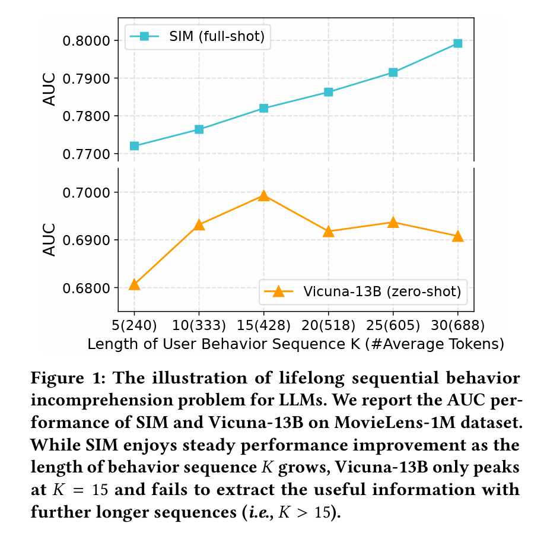
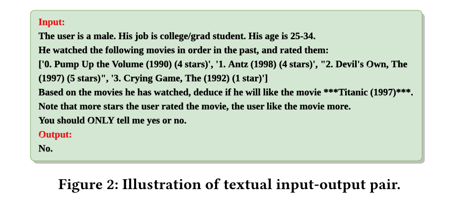

# 🔥ReLLa: Retrieval-enhanced Large Language Models for Lifelong Sequential Behavior Comprehension in Recommendation

## Motivation
LLM在推荐领域中无法从长用户行为序列的文本上提取有用信息，即使文本长度远远没有达到LLM的文本长度限制。

## Introduction

 对零样本，提出了SUBR，用最近的K个语义最接近的来做截断，而不是仅仅是最近的K个。对few-shot, 除了用SUBR来提升数据质量，又提出了REti来促进LLM解决长序列表现差。  
主要贡献：  
1.确定并完善了推荐领域中LLMs（大型语言模型）的终身序列行为理解问题  
2.RElla + SUBR + ReiT  
3.few-shot in Rella > full-shot with baseline model  

## Preliminaries

$(x_i, y_i)$ --> ("item", "YES/NO")  
  
K = 4 in figure 2 (4 items)  

## Method

 ## appendix
 [[CTR任务]](https://zhuanlan.zhihu.com/p/372110635)

**Q1:** what is zero-shot and few-shot recommendation?  
**A1:** Zero-shot recommendation implies that a model is directly em
ployed for the target recommendation task without any tuning on
 the in-domain training data. Apparently, traditional recommenda
tion models are incapable of accomplishing zero-shot recommen
dation tasks, since they are randomly initialized. However, LLMs
 possess a vast volume of open-world knowledge and logical rea
soning abilities, which enable them to infer the user’s preference
 towards a certain target item based on the profile of user/item.
 Few-shot recommendation refers to low-resource scenarios with
 𝑁 training data samples. 𝑁 denotes the number of shots, which is
 a relatively small number. This highly requires the data efficiency
 characteristic of an algorithm to fully exploit the limited number of
 training samples to achieve better recommendation performance.
Extending from the definition of few-shot recommendation, we
 can therefore define full-shot recommendation as the setting where
 we train the model based on the entire training set.

